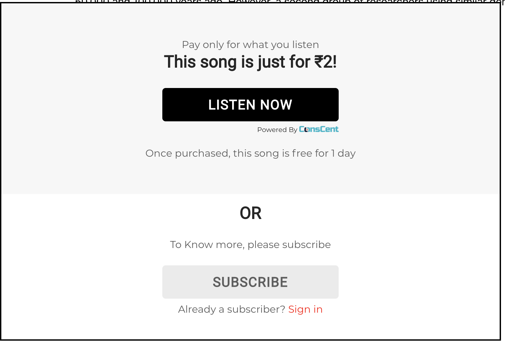
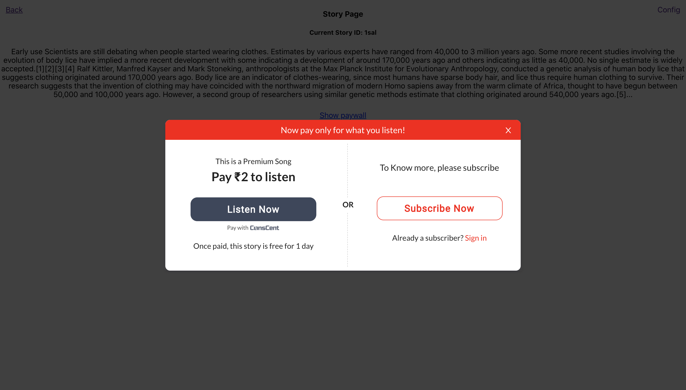

# Customizing the paywall

There are a number of ways you can modify the paywall to suit the look and feel of your website.
**This customisation happens by passing parameters to the `csc('init', { ...args})` conscent initialisation function on your website. All parameters must be passed within the args object**

## Screen Type

There are two main screens available which completely modify the appearance of your paywall.

### Default screen

This is the screen included by default but will soon be replaced by the beta screen
This is the black/grey and white screen with a black border.

<p align="center">
  
</p>

### Beta screen

To opt into the beta screen please pass the parameter 'screenType' with the value of 'beta'.
Additionally, you should specify the accent color, so that the subscription button will take on the color of your website.
e.g. Your initialization object should include these parameters:

```
  screenType: 'beta',
  accentColor: '#ff0000',
```

<p align="center">
  
</p>

## Action words

Your paywall will contain words like 'Read Now', 'Unlock Now', 'Watch now'. This action word depends on the contentType, which you can find out about in the API docs if you follow content registrations

If you have only one type of content, you can request for your content type to be changed -- e.g. if you have podcasts, you might want 'Listen Now' instead.

## Fullscreen Mode

The paywall by default is embedded in a div on your website. If you want the paywall to cover the entire screen instead, you can pass in the following parameter

```
  fullScreenMode: true,
```

<p align="center">
  
</p>

## Button Mode

If you pass the following parameter, ConsCent reduces in form factor to a simple button.

```
  buttonMode: true,
```

You can control the styling of the button by passing your custom css styles as json in your client dashboard under the paywall settings section

**Note: this is not compatible with fullscreen mode**

## Misc Options

These options will partially modify the appearance of the paywall.

### Subscription

Include this parameter and set its value to whatever the subscription url is.

```
subscriptionUrl: 'https://your-subscription-page.com',
```

Doing will add a subscription button section to the paywall

**You can customize the subscription text shown on the paywall by changing it in the client dashboard under the paywall settings section**

### Sign-in url

```
signInUrl: 'https://your-signin-page.com',
```

Adding this page will prompt the user to sign in below the subscription button.
Not: This parameter does nothing if a subscriptionUrl is not included.

### Translucency Filter

If you want conscent to cover a dom element in your website when the user hasn't paid for content and automatically unhide it upon payment, you can pass the id of the element as show below. This is handy if you want to make an integration with little to no control of your website.

```
  translucencyId: 'id-of-your-element',
```

## CSC - Icon Positioning

After content is unlocked on the web, a conscent icon is visible to the user. The positioning of this icon can be controlled.
It can be positioned on the bottom of the webpage or the right of the webpage, and its exact position can be controlled via the following parameters

```
{
...(other variables)
  CSCIconPosition: 'bottom',
  CSCIconOffset: '80%',
}
```

CSCIconPosition positions the icon to the right or to the bottom of the browser, the possible values for this variable are 'bottom' or 'right'.

CSCIconOffset's value can be any valid css value (e.g. '10px' or '50%') which will set the distance of the icon from the edge of the browser window.
