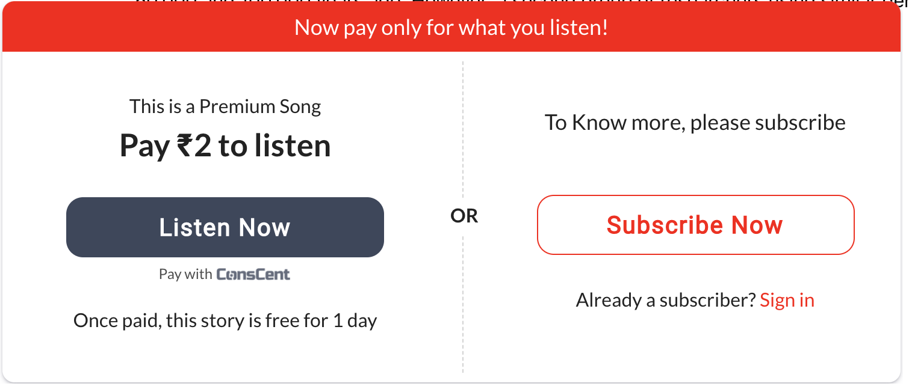

## Donations

#### Prerequisites

- Make sure you have access to your client panel & client details (clientId)

#### Web Integration

1. The integration is fairly simple, include the conscent script in the head of your html page

```
<script>
  const clientId = '5f92a62013332e0f667794dc'; // REPLACE THIS!
  (function (w, d, s, o, f, cid) {
    if (!w[o]) {
      w[o] = function () {
        w[o].q.push(arguments);
      };
      w[o].q = [];
    }
    (js = d.createElement(s)), (fjs = d.getElementsByTagName(s)[0]);
    js.id = o;
    js.src = f;
    js.async = 1;
    js.title = cid;
    fjs.parentNode.insertBefore(js, fjs);
  })(window, document, 'script', '_csc', {SDK_URL}, clientId); // REPLACE SDK_URL!
</script>
```

- Replace clientId with the clientId available to you in integration section of the client dashboard
- Replace {SDK_URL} with
  - 'https://sandbox-sdk.conscent.in' for sandbox (test mode)
  - 'https://sdk.conscent.in' for production

2. When you and the donation window to appear, initialize conscent donation with the following snippet after replacing the variable values or omitting the variables you don't need:

```
_csc('init-donation', {
        debug: true,
        content: {
          id: 'donation-1',
          title: 'Are glass bottles the future?',
          url: 'http://localhost:8080/donation',
        },
        receiver: {
          avatarUrl: 'https://placekitten.com/300/300',
          name: 'Kitten Narang',
          id: 'kittsu',
          pitchMessage: '',
          thankyouMessage: '',
          posts: '12',
          views: '243',
        },
        deepLink: '',
        clientId: 'your-client-id',
        wrappingElementId: 'csc-paywall',
    });
```

**receiver name, receiver avatarUrl and clientId are mandatory!**

#### Android / iOS Integration

1. You need to design a pop-up or a callout for the user to click on to initate the donation. Something similar to the image below is advisable

<p align="center">
  
</p>

2. When the user has clicked, [create a donation as outlined here.](https://tsbmediaventure.github.io/developer-docs/#donations) Make sure to include a deeplink for the user to return to the app when his donation process ends.

3. Use the donation id return in the donation creation call and redirect the user to the default browser (not in-app browser!) to this url: {URL}/donation?donationId={donationId}

Here {URL} is `https://user.conscent.in/` for production and `https://sandbox-user.conscent.in/` for sandbox mode.
{donationId} is the donationId return from the create donation endpoint
